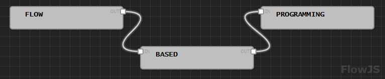
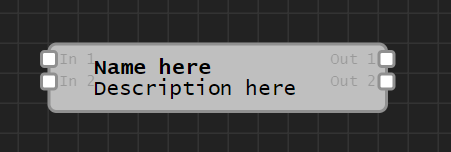

## FlowJS

FlowJS is a visual designer to create and manipulate nodes and links between them.



### Table of contents

- [Files](#files)
- [Designer](#designer)
- [Configuration](#configuration)
- [Nodes](#nodes)
- [Callbacks](#callbacks)
- [Validiation](#validation)
- [Export](#export)
- [Import](#import)
- [Roadmap](#roadmap)

### Files 

FlowJS functionality is split into several files located in `./src`. These files have been combined into `./dist/flow.js` by using the configuration specified in `filepack.config.json`  (filepack on [NPM](https://www.npmjs.com/package/filepack) and [GitHub](https://github.com/DanieLeeuwner/filepack)).

### Designer

FlowJS defines a Designer class. Minimal initialization requires an HTML element to populate with the visual designer.

HTML element on page:

```html
<div id="container"></div>
```

Initialization in JavaScript:

```js
var designer = new Designer({
    container: container
});
```

### Configuration

The FlowJS designer takes a couple of configuration options.

| Option       | Description                                                  |
| ------------ | ------------------------------------------------------------ |
| `container`  | HTML element to display designer. See [Designer](#designer). |
| `scale`      | Initial scale to display. Default 1. See [Changing the scale](#changing-the-scale). |
| `theme`      | Theme configuration object. See [Theme](#theme).             |
| `callbacks`  | Callback events to fire for specific actions. See [Callbacks](#callbacks). |
| `validation` | Validation events to fire for specific actions. See [Validation](#validation). |
| `import`     | Nodes and links to import. See [Import](#import).            |
| `width`      | Width of the designer area. Default 5000.                    |
| `height`     | Height of the designer area. Default 5000.                   |

Example of initializing the designer with the default dark theme:

```js
var designer = new Designer({
    container: container,
    theme: FlowJS.Theme.Dark
});
```

Some aspects of the designer are defined within `./src/_config.js`. Like with theme changes, the designer must be refreshed for changes to take effect.

### Theme

FlowJS defines two basic themes. These are contained within `FlowJS.Theme.Light` and `FlowJS.Theme.Dark` objects (See `./src/_theme.js`). A custom theme object can be used instead of these when initializing a new Designer object.

The theme object contains the following properties:

| Property          | Description                                                  |
| ----------------- | ------------------------------------------------------------ |
| `Grid`            | Color of the grid lines.                                     |
| `Background`      | Color of the grid background.                                |
| `Focus`           | Outline of selected nodes and links.                         |
| `SelectionBorder` | Selection rectangle border color.                            |
| `SelectionFill`   | Selection rectangle background color.                        |
| `Link`            | Array containing colors to randomly assign to links. Default configuration uses an array containing a single color. |
| `ConnectorBorder` | Border color of connection points.                           |
| `ConnectorFill`   | Connector fill color.                                        |
| `Watermark`       | FlowJS watermark color.                                      |

Example of changing the background color of the designer:

```js
designer.theme.Background = '#110000';
designer.refresh();
```

### Nodes

Creating a node requires a node object to be passed to the `designer.createNode` function.

Node objects contain the following properties:

| Property      | Description                          |
| ------------- | ------------------------------------ |
| `name`        | Name displayed on the node.          |
| `description` | Description displayed on the node.   |
| `inputs`      | Array of input names.                |
| `outputs`     | Array of output names.               |
| `data`        | Custom node configuration.           |
| `x`           | X coordinate of the node. Default 0. |
| `y`           | Y coordinate of the node. Default 0. |

Example of creating a node with two inputs and two outputs:

```js
var newNode = {
    name: 'Name here',
    description: 'Description here',
    inputs: [ 'In 1', 'In 2' ],
    outputs: [ 'Out 1', 'Out 2' ],
    data: { }
}
designer.createNode(newNode);
```




### Callbacks

Callbacks can be specified as part of the designer initialization process. These callbacks allow other actions to be executed when specific designer events occur. See [Configuration](#configuration).

All callback events should be functions that expect the specified parameter. 

| Callback         | Parameter | Description                        |
| ---------------- | --------- | ---------------------------------- |
| `linkCreated`    | Link      | Link is created between two nodes. |
| `linkSelected`   | Link      | Link is selected.                  |
| `linkUnselected` | Link      | Link is unselected.                |
| `linkDeleted`    | Link      | Link is deleted.                   |
| `nodeSelected`   | Node[]    | Node is selected.                  |
| `nodeUnselected` | Node[]    | Node is unselected.                |
| `nodeDeleted`    | Node[]    | Node is deleted.                   |
| `nodeOpened`     | Node      | A selected node is clicked.        |
| `nodeMoved`      | Node[]    | Node is moved.                     |

### Validation

Validation events can be specified as part of the designer initialization process. These validation events allow rules to be applied to the process. See [Configuration](#configuration).

All validation events should be functions that expect the specified parameter and return a boolean result. 

| Validation   | Parameter            | Description           |
| ------------ | -------------------- | --------------------- |
| `linkCreate` | Connector, Connector | Link creation request |
| `linkDelete` | Link                 | Link delete request   |
| `nodeDelete` | Node[]               | Node delete request   |

### Controls

| Control | Action |
| ------- | ------ |
| <kbd>Del</kbd> | Delete currently selected nodes or link. |
| <kbd>Esc</kbd> | Unselect currently selected nodes. |
| Mouse wheel | Scroll vertically (default implementation). |
| <kbd>Shift</kbd> + Mouse wheel | Scroll horizontally (default implementation). |
| <kbd>Ctrl</kbd> + Mouse wheel | Change designer zoom level. |
| <kbd>Ctrl</kbd> + Left mouse button | Move designer viewport. |
| <kbd>Shift</kbd> + Left mouse button | Select multiple nodes. |

### Export

An export is created by calling `designer.export()`. This returns an object containing the nodes and links between them.

Example of export JSON:

```json
{
    "nodes": [
        // array of node objects
    ],
    "links": [
        // array of link objects
    ]
}
```

Node properties:

| Property          | Description                                                  |
| ----------------- | ------------------------------------------------------------ |
| `id`              | Node identifier. 8 characters.                               |
| `x`               | X position.                                                  |
| `y`               | Y position                                                   |
| `type`            | Type provided during node initialization.                    |
| `name`            | Name text.                                                   |
| `description`     | Description text.                                            |
| `data`            | Node data.                                                   |
| `backgroundColor` | Background color provided during node initialization.        |
| `foregroundColor` | Foreground color provided during node initialization.        |
| `borderColor`     | Border color provided during node initialization.            |
| `inputs`          | Input connection points. See Input/Output properties below.  |
| `outputs`         | Output connection points. See Input/Output properties below. |

Input/Output properties:

| Property | Description                               |
| -------- | ----------------------------------------- |
| `id`     | Connector identifier. 4 characters.       |
| `name`   | Name provided during node initialization. |

Link properties:

| Property | Description                                            |
| -------- | ------------------------------------------------------ |
| `source` | Source node and connector. '{node.id}.{connector.id}'. |
| `target` | Target node and connector. '{node.id}.{connector.id}'. |
| `stroke` | Stroke color assigned to link during creation.         |

### Import

Import requires an object in the exact JSON format provided by the export function. Import can be done during the designer initialization, or after the designer has been initialized. Import after initialization requires the designer to be refreshed.

Example of import during initialization:

```js
var importData = { 
    nodes: [
      // array of node objects
    ],
    links: [
      // array of link objects
    ]
}

var designer = new Designer({
    container: container,
    import: import
});
```

Example of import after initialization:

```js
designer.import(import);
designer.refresh();
```

### Roadmap

| Item                | Description                                                  |
| ------------------- | ------------------------------------------------------------ |
| Dynamic node height | Change the height of nodes to automatically fit longer titles and descriptions. |
| Connector popup     | Display a popup next to connectors showing the name, this will replace the current connector text which is displayed inside the node. |
| Node icon           | Add icon to node.                                            |
| Node image          | Add an image to node, this will display below the description. |
| Minimap             | Display minimap of nodes, links, and current scroll position. |
| Designer info       | Display info about designer (x, y, scale, total nodes, etc.). |
| Mobile support      | Support for multi-touch gestures.                            |
| Node unselect       | Node unselect when using <kbd>Shift</kbd> + Left mouse button on selected node. |
| History             | Support for undo and redo actions.                           |

